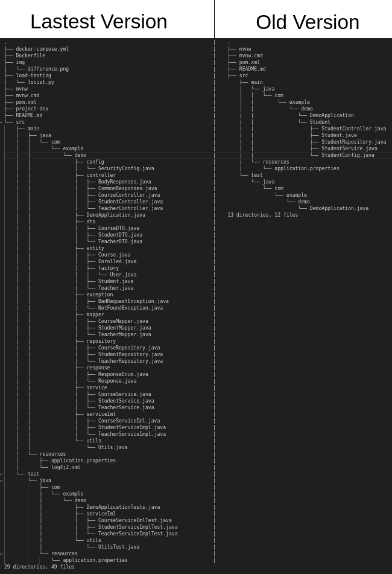

# Spring-boot-app

I created this application to learn Spring Boot and PostgreSQL. In addition, I implemented the design pattern, unit testing, performance testing, test coverage reporting, bash script to aid developers/users, continuous integration (CI), and Docker deployment. Furthermore, I migrated the application from Spring Boot 2.x to 3.x. I started this project by following the [Spring Boot Tutorial | Full Course [2022] [NEW]](https://www.youtube.com/watch?v=9SGDpanrc8U&ab_channel=Amigoscode) from [Amigoscode](https://www.youtube.com/@amigoscode) and improved upon it. I would like to thank the author for inspiring me to start this project.

Here you can see the difference between the **LATEST VERSION** and **OLD VERSIONS** of this application.



## Usage
Docker Desktop must be installed. To run the app just use the below command.

```
$ sudo ./project-dev code-run
```

Ready to go. you can test the API with the below example.
```bash
curl --location 'http://localhost:8080/api/v1/student' \
--header 'Content-Type: application/json' \
--header 'Authorization: Basic YWRtaW46YWRtaW4=' \
--data-raw '{
  "name": "Serdar AKYOL",
  "email": "serdarakyol@asd.com",
  "dob": "2000-02-23"
}'
```

### About `project-dev` file
This bash script was created to make it easier for people to use this API. To access the help menu, simply run `$ project-dev help` and the output should be as shown below:
```
Usage: ./project-dev <command>
<command>:
    help
        Display this help message.
    build-jar
        Build jar file
    code-run
        Runs containerized app
    performance-test
        Stress testing for the API
    test-coverage-report
        Shows unit test coverage reports
    prepare-report
        Prepares the report to send the developer for debugging
```

## Test
To run unit tests, first navigate to the root directory of this project and execute the command $` mvn test`.

Note: With the PR of [Add more unit tests](https://github.com/serdarakyol/spring-boot-app/pull/49) improved the test coverage up to 65%. If you want to see current test coverage report, you need to run below command.

`$ ./project-dev test-coverage-report`

[Locust](https://github.com/locustio/locust) has been used for performance testing. Please ensure that the API is running before executing the performance test command `./project-dev performance-test`.

## Please do not hesitate to create an issue to help me improve my skills.
